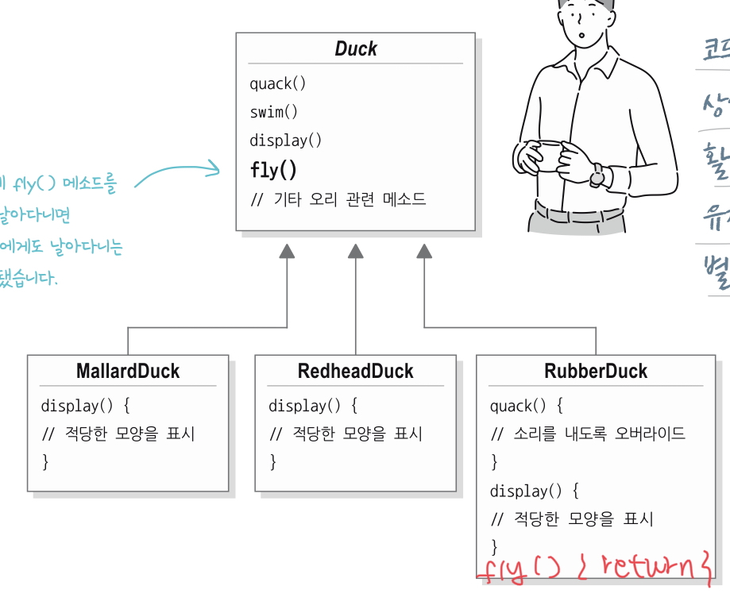
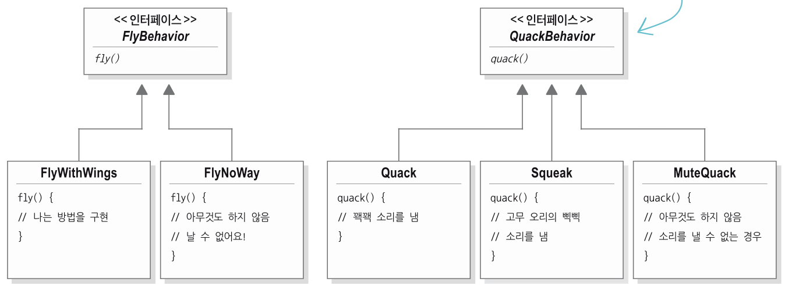

# Chapter 1. 디자인 패턴의 세계로 떠나기

## 전략 패턴
* 책에 나온 문제 상황 예시를 살펴보겠습니다.
* 변화에 영향을 최소화 하자
* 변하는 부분과 변하지 않는 부분을 잘 분리하자
* 변하는 부분은 분리하여 캡슐화하자
* 상속보다 구성(Composition)을 먼저 고려해보자

## 오리시뮬레이션 게임, SimUduck

### 상속으로 구현


슈퍼 클래스 `Duck`, 자식 클래스 `MallardDuck, RedheadDuck` 클래스가 있다.  
슈퍼 클래스에는 `quack(), swim(), display()` 메서드가 있지만, 자식 클래스들은 `display()` 만 재정의해서 사용한다.  
코드를 재사용할 수 있어서 업무 효율이 정말 좋았다.  

### 상속으로 비행 추가하기
갑자기 기획이 변경되며 오리가 비행을 할 수 있어야 한다는 말을 들었다.


비행 기능을 추가하기 위해서 슈퍼 클래스 `Duck`에 `fly()` 메서드를 추가했다. 코드 재사용성이 증가했고 생산성이 좋다고 생각했다.  
문제는 새로 정의된 자식 클래스인 `RubberDuck은` 날면 안된다.   
반면에 우리는 "상속"을 하고 있기 때문에 자식 클래스들은 슈퍼 클래스의 코드를 무조건 그대로 물려받는다.

그래서 메서드 오버라이드를 통해서 `fly()` 메서드의 구현부를 비워버렸다.



문제가 해결 되었다. 그렇지만 코드 재사용성을 잃었다. 생산성도 떨어진 것 같다.
상속을 활용한 구현에서는 생산성(코드 재사용), 확장성, 유연성 모두 만족스럽지 못하다.  
더 좋은 방법이 없을까?  

### 인터페이스
기획자와 이야기해보니 비행과 울음 기능은 자주 변경이 발생할 것 같다고 한다. 그때마다 오버라이드하고 싶지 않으니 인터페이스를 설계하기로 했다.
`Flyable` 인터페이스와 `Quackable` 인터페이스를 정의하고 각각 `fly(), quack()` 메서드를 정의했다.


이제 원하는 오리들만 `Flyable, Quackable` 을 "구현"하면 된다.   
오리 외의 클래스들도 마음껏 비행, 꽥 행동을 할 수 있게 되었다.  

그런데 많은 오리 중 날지 못하는 오리는 RubberDuck 하나 뿐이다.   
오리의 종이 50개라고 할 때 단 하나의 오리 때문에 매번 `fly()` 메서드에 같은 코드를 반복해서 작성해야할까?  
게다가 `fly()` 의 구현 방식이 변경 되었다면 클래스마다 코드를 모두 수정해야한다.  

인터페이스 방식도 확장성은 만족스럽지만 생산성, 유연성 모두 만족스럽지 못하다.  
어떻게 하면 변화에 대한 영향을 최소화할 수 있을까?  

### 행동을 클래스로 분리
인터페이스 방식이 유연성은 그렇다고 쳐도 생산성이 정말 좋지 않은 거 같다. 이를 행동을 인스턴스화 하여 해결해보자  



언뜻보면 인터페이스에서 살펴본 `Flyable`과 비슷해보인다. 핵심은 구현체 코드가 위임 되었다는 점이다.  

AS-IS: 구현체 코드가 Duck 클래스에 존재  
TO-BE: 구현체 코드가 행동 클래스에 존재  

이제 우리가 정의한 행동 클래스를 사용하기만 하면 된다. 어떻게 사용할 수 있을까?     


멤버 변수로 포함시킨 후 행동 클래스의 메서드를 호출하면 된다.  
이 방식은 확장성, 생산성, 유연성 모두 만족스러운 수준이다.  

#### 확장성
새로운 날기 방식이 생긴다면 `FlyBehavior` 의 구현 클래스를 하나 더 추가하면 된다.  


#### 생산성
구현체 코드를 각 클래스에 "위임"했기 때문에 행위의 갯수만큼만 코딩하면 된다.

오리 클래스가 50 종류이고, RubberDuck 만 날지 못하고, 다른 오리들은 모두 날 수 있을 때 코드 반복 횟수 비교  
AS-IS: `Duck` 클래스의 `fly()` 구현체에서 반복  
TO-BE: 반복 없음  

#### 유연성
날기 방식이 변경되었다면 어떻게 해야 할까 `FlyWithWings`의 구현체만 수정하면 된다.  
`FlyWithWings` 를 사용하던 오리들은 자동으로 수정 사항이 반영된다.  

오리 클래스가 50 종류이고, RubberDuck 만 날지 못하고, 다른 오리들은 모두 날 수 있을 때 코드 수정 발생 비교
AS-IS: `Duck` 클래스의 `fly()` 구현체에서 49번 발생 
TO-BE: `FlyWithWings`의 `fly()` 구현체에서 1번 발생 


최종적으로는 아래와 같은 코드를 작성할 수 있다.  

```
public class Main {

	public static void main() {
		Duck donald = new DonalDuck(new FlyWithWings());
		donal.fly(); // 날개로 날아요

		Duck rubber = new RubberDuck(new FlyNoWay());
		rubber.fly(); // 못날아요
	}

       
	public abstract class Duck {
		protected FlyBehavior flyBehavior;

		protected Duck(FlyBehavior flyBehavior) {
			this.flyBehavior = flyBehavior;
		}

		public void fly() {
			flyBehavior.fly();
		}
	}

	public class DonaldDuck extends Duck {
		DonaldDuck(FlyBehavior flyBehavior) {
			super(flyBehavior);
		}

		// todo
	}

	public class RubberDuck extends Duck {
		RubberDuck(FlyBehavior flyBehavior) {
			super(flyBehavior);
		}

		// todo
	}

	public interface FlyBehavior {
		void fly();
	}

	public class FlyWithWings implements FlyBehavior {
		@Override
		public void fly() {
			System.out.println("날개로 날아요");
		}
	}

	public class FlyNoWay implements FlyBehavior {
		@Override
		public void fly() {
			System.out.println("못날아요");
		}
	}
}
```

### 코드를 바꿔야 했던 이유?
* 발견되지 않던 버그가 발생해서
* 우리가 사용하던 외부 API가 서비스를 종료해서
* 버전 업데이트를 위해서
