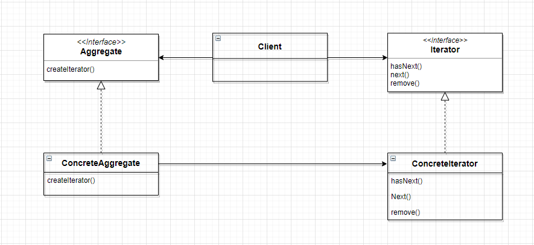
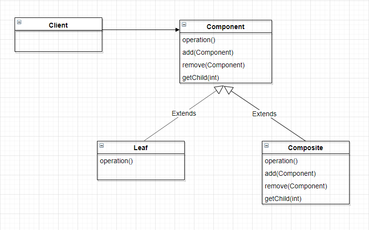

# 반복자(Iterator) 패턴

- 객체를 저장하는 방식은 보여주지 않으면서도 클라이언트가 객체들에게 일일이 접근할 수 있게 해주는 방법인 이터레이터 패턴(iterator pattern)
- 이터레이터 패턴을 사용하면 모든 항목에 일일이 접근하는 작업을 컬렉션 객체가 아닌 *반복자 객체*에서 맡게 된다.

## 반복을 캡슐화하자.

- 바뀌는 부분은 캡슐화한다.
- 반복 작업을 캡슐화해서 Iterator라는 객체를 만든다.
- 이터레이터(Iterator) 패턴에서 중요한 것은 Iterator라는 인터페이스에 의존한다는 것이다 . Iterable과 Iterator를 잘 구분하자.
- <b>이터레이터 패턴은 컬렉션 구현 방법을 노출시키지 않으면서도 그 집합체 안에 들어있는
  모든 항목에 접근할 수 있게 해주는 방법을 제공해 준다.</b>

## 이터레이터 패턴의 클래스 다이어그램



- Iterator
  - 모든 반복자에서 구현해야 하는 인터페이스를 제공한다.
  - 컬렉션에 들어있는 원소들에 돌아가면서 접근할 수 있게 해 주는 메서드들을 제공한다.
- ConcreteIterator
  - 반복작업 중에 현재 위치를 관리한다.
- Aggregate: 공통적인 인터페이스
- ConcreteAggregate
  - 객체 컬렉션이 들어있고, 그 안에 들어있는 컬렉션에 대한 Iterator를 리턴하는 메서드를 구현한다.
  - 모든 ConcreteAggregate는 그 안에 있는 객체 컬렉션에 대해 돌아가면서 반복 작업을 처리할 수 있게 해주는 ConcreteIterator의 인스턴스를 만들 수 있어야 한다.

## 내부(iternal) 반복자와 외부(external) 반복자

### 내부(iternal) 반복자

- 반복을 제어하는 주체: 반복자 자신에 의해 제어한다.

  - 반복자가 자신이기 때문에 다음 원소에 대해서 어떤 작업을 직접 처리한다.

- 따라서 반복자에게 모든 원소에 대해서 어떤 일을 할지 직접 알려줘야 한다.
- 내부 반복자는 클라이언트가 반복작업을 마음대로 제어할 수 없기 때문에 _외부 반복자보다 유연성이 떨어진다._
- ex) stream에서 내부적으로 for문을 돌리는 것

### 외부(external) 반복자

- 반복을 제어하는 주체: 클라이언트가 반복작업을 제어한다.
- 클라이언트에서 next()를 호출해서 다음 항목을 가져온다.

## JS Iterators and generators

- https://developer.mozilla.org/ko/docs/Web/JavaScript/Guide/Iterators_and_Generators

# 컴포지트 패턴(Composite pattern)

- 컴포지트 패턴은 객체들의 관계를 트리구조로 표현하는 패턴으로, 사용자가 단일 객체와 복합 객체를 모두 동일하게 다룰수 있도록 구조화한 패턴이다.
- 컴포지트 패턴을 이용하면, 객체들을 트리 구조로 구성해서 부분과 전체를 나타내는 계층 구조를 만들 수 있다.
- 클라이언트에서 개별 객체와 다른 객체들로 구성된 복합 객체(compoiste)를 똑같은 방법으로 다룰 수 있다.

## 컴포지트 패턴의 클래스 다이어그램



- 컴포지트 패턴을 이용하면, 복합 객체와 개별 객체를 구분할 필요가 없어진다.
  복합 구조에 들어있는 것을 구성요소라고 부른다.
- 구성요소에는 복합 객체와 잎(leaf) 노드가 있다.
- 잎(leaf) 노드든 아니든 똑같이 구현할 수 있게 되는 것이다.

## Example

- 디렉토리 구조

```ts

interface Document {
    public delete(): void;
}

class Folder extends Document {
    private contents: Array<Document> = [];

    public delete() {
        for(Document doc of contents) {
            doc.delete();
        }
    }

    public addContents(Document content) {
        this.contents.add(content);
    }
}

class File extends Document {
    // something....

    public delete() {
       // delete ...
    }
}

Folder root = new Folder();
Folder subdir = new Folder();
root.addContents(subdir);
subdir.addContents(new File());
root.addContents(new File());
root.delete();
```

## 장점

- 데이터를 다루다보면 계층형 트리 자료구조로 저장되고 이를 다루게되는 경우가 종종 생긴다.
- 이때 composite패턴을 사용하면 클라이언트측에서 모든 데이터를 모르더라도 복잡한 트리구조를 쉽게 다룰수 있다.
- 새로운 leaf로서의 클래스를 추가하더라도 클라이언트는 상위 추상화된 인터페이스만을 바라보기 때문에, OCP를 준수할 수 있다.

## 단점

- 계층형 구조에서 leaf에 해당하는 객체와 Node에 해당하는 객체들 모두를 동일한 인터페이스로 다루어야하는데, 이 인터페이스 설계가 어려울 수 있다. 이럴때는 디자인패턴에 억지로 끼워맞추려는것은 아닌지 다시 생각해볼필요가 있다.
