# 브리지 패턴
구현과 더불어서 추상화 부분까지 변경해야 한다면 브리지 패턴을 사용하면 좋다  
만약 리모컨 프로그램을 개발한다고 하자. 리모컨을 추상화하고 TV 모델마다 많은 구현 코드를 사용해야 한다.  

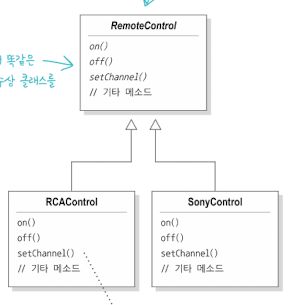

그래서 브리지 패턴으로 추상화된 부분과 구현 부분을 서로 다른 클래스 계층구조로 분리해서 그 둘을 모두 변경할 수 있다.  

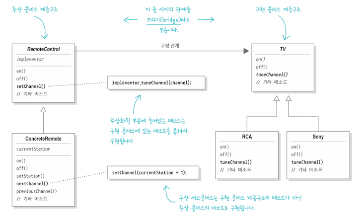

장점
- 구현과 인터페이스가 약한 결합이므로 변화에 서로가 영향을 받지 않는다.

단점
- 디자인이 복잡해진다

# 빌더 패턴
인스턴스를 여러 단계로 나눠서 생성하도록 생성 단계를 캡슐화하고 싶다면 빌더 패턴을 사용한다.  

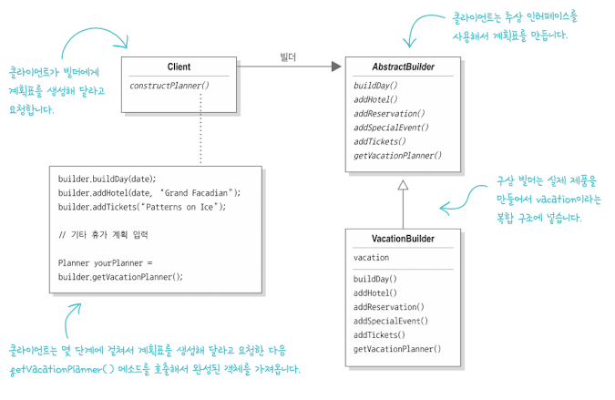

장점
- 여러 단계에 걸쳐서 객체를 생성하면서 생성 단계를 나눌 수 있다.
- 제품 내부 구조를 클라이언트로부터 보호할 수 있다.
- 추상 인터페이스를 사용하면 코드를 쉽게 바꿀 수 있다.

# 책임 연쇄 패턴
1개 요청을 2개 이상의 객체에서 처리해야 한다면 이 패턴을 사용하자  
메일을 분류하는 디자인을 만들어보자  

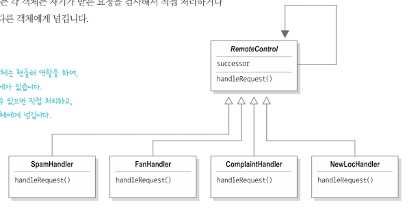
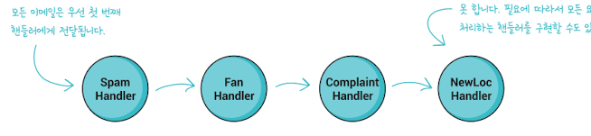

장점
- 요청을 보낸 쪽과 받는 쪽을 분리할 수 있다

# 플라이웨이트 패턴
인스턴스 하나로 가상 인스턴스를 제공하고 싶다면 이 패턴을 쓰자. 

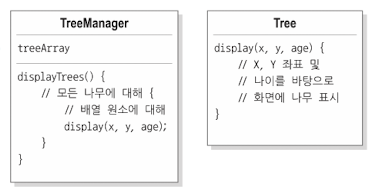

트리의 정보를 매니저가 가지고 있다가 트리의 상태가 변하지 않는 인스턴스를 리턴한다.

# 인터프리터 패턴
어떤 언어의 인터프리터를 만들어야 할 때 사용한다.  
문법과 구문을 번역하는 인터프리터를 기반으로 언어를 정의한다.  

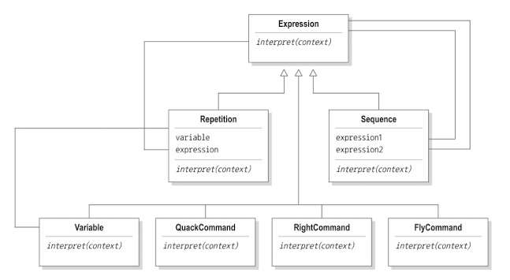

# 중재자 패턴
객체 사이의 복잡한 통신과 제어를 한 곳으로 집중하고 싶다면 중재자 패턴을 사용하자  

AS-IS: 
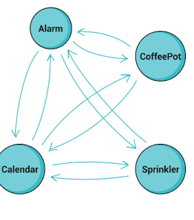

TO-BE:
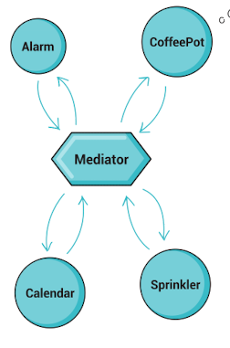

이제 새로운 통신이 생기거나 통신 규칙이 변하면 중재자만 고치면 된다

# 메멘토 패턴
객체를 이전의 상태로 복구해야 한다면 메멘토 패턴을 쓰자  

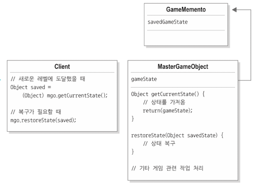

객체의 상태를 저장해놓고 필요할때 다시 꺼내 쓰면 된다.

# 프로토타입 패턴
어떤 클래스의 인스턴스를 만들 때 자원과 시간이 많이 들거나 복잡하면 이 패턴을 쓰자  

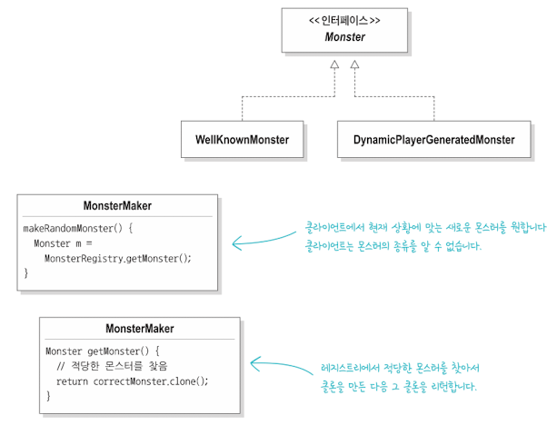

기존 인스턴스를 복사하면 새로운 인스턴스를 만들 수 있다.  
클라이언트가 어떤 클래스의 인터페이스를 만드는지 전혀 몰라도 만들 수 있다.  

# 비지터 패턴
캡슐화가 별로 중요하지 않다면 비지터 패턴을 쓰자

AS-IS:
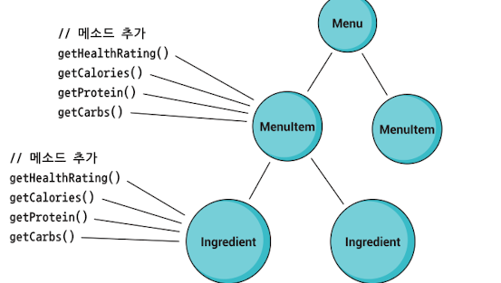

TO-BE:
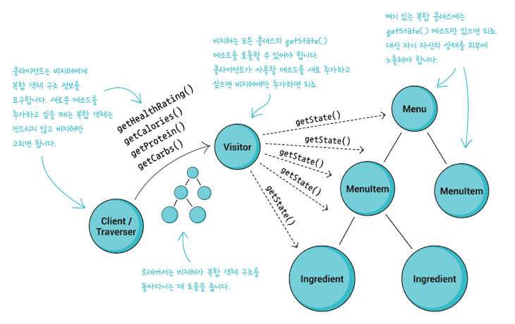

객체 내에 있는 다른 객체에 접근하는 것을 도와준다.  
